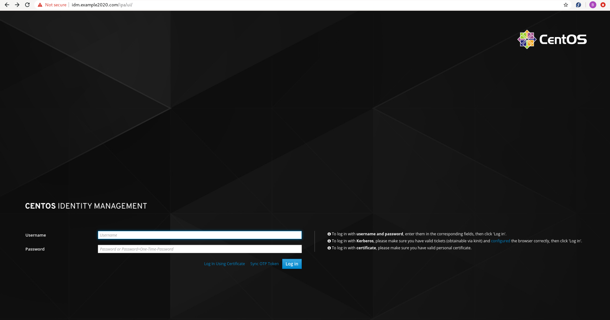

# 8th TDD Iteration --> Configure Ansible Molecule to use AWS EC2 Instances.

Last updated: 07.06.2020

## Purpose

The purpose of this iteration is to configure Ansible Molecule to use
AWS EC2 instances for the IDM ansible role testing.

## Installation

1. Make sure you activate your virtual environment
1. Run the following command `pip install boto boto3 molecule[ec2]`.
    These software packages allow interaction with Amazon AWS.

## Procedure
1. cd idm-install
1. In order to keep the **Docker** testing separate from **AWS** testing,
we will create a scenario called **aws**.  Run the following command to
create the **aws** scenario.

    ```shell script
    molecule init scenario -d delegated --role-name idm-install aws
    ```

    The reason we used the **delegated** provider is because Ansible
    Molecule does not have a driver for AWS.  The **delegated** driver
    provides the developer the ability to create their own
    driver, whether that is AWS, Google, Azure, or something else.
    
    One of the pre-requisites in using the **delegated** driver is
    the developer must provide data to molecule in a format called
    **instance-config.yml**. Molecule expects the storage of the
    file at the following location:
     
    **$HOME/.cache/molecule/<role-name>/<scenario-name>/instance_config.yml**

    Here is an example of the file:
    
    ```yaml
    - address: 10.10.15.17
     identity_file: /home/bmullinix/.ssh/id_rsa # mutually exclusive with
                                            # password
     instance: aws-idm-instance
     port: 22
     user: admin
    # password: ssh_password # mutually exclusive with identity_file
     become_method: sudo # optional
    # become_pass: password_if_required # optional
    ```

    The Ansible Molecule **delegate** driver creates an ansible stub to fill
    in to generate the **instance_config.yml** in our **create.yml**
    and remove it in the **destroy.yml**.  Here are examples
    of the **create.yml** and **destroy.yml** before we fill in the proper
    data for AWS to populate the stubs:
    
      1. **create.yml** -->
      
          ```yaml
          - name: Create
            hosts: localhost
            connection: local
            gather_facts: false
            no_log: "{{ molecule_no_log }}"
            tasks:
          
          # TODO: Developer must implement and populate 'server' variable
      
          - when: server.changed | default(false) | bool
            block:
              - name: Populate instance config dict
                set_fact:
                  instance_conf_dict: {
                    'instance': "{{ }}",
                    'address': "{{ }}",
                    'user': "{{ }}",
                    'port': "{{ }}",
                    'identity_file': "{{ }}", }
                with_items: "{{ server.results }}"
                register: instance_config_dict
      
              - name: Convert instance config dict to a list
                set_fact:
                  instance_conf: "{{ instance_config_dict.results | map(attribute='ansible_facts.instance_conf_dict') | list }}"
      
              - name: Dump instance config
                copy:
                  content: "{{ instance_conf | to_json | from_json | molecule_to_yaml | molecule_header }}"
                  dest: "{{ molecule_instance_config }}"
          ```
      1. **destroy.yml** -->

          ```yaml
          - name: Destroy
            hosts: localhost
            connection: local
            gather_facts: false
            no_log: "{{ molecule_no_log }}"
            tasks:
              # Developer must implement.
          
              # Mandatory configuration for Molecule to function.
          
              - name: Populate instance config
                set_fact:
                  instance_conf: {}
          
              - name: Dump instance config
                copy:
                  content: "{{ instance_conf | to_json | from_json | molecule_to_yaml | molecule_header }}"
                  dest: "{{ molecule_instance_config }}"
                when: server.changed | default(false) | bool
          ```


1. **RED** --> Test when no configuration has been added for AWS.
    
    1. cd molecule/aws
    1. rm verify.yml
    1. Make the file **verify.yml**.
    1. Add the following code to the **verify.yml**.
        
        ```yaml
       ---
       - name: Verify
         hosts: all
         tasks:
       
           - name: Run a simple command on the EC2 instance
             shell:
               cmd: "echo 'We have configured AWS and launched the EC2 instance.'"
        ```
           
        The tasks above checks to see if AWS the EC2 instance
        is running and accessible.
        
    1. cd ../..
    1. Run `molecule verify -s aws`.  The test should fail.  The test represents
       the **Red** in the **Red, Green, Refactor** iteration of TDD.

1. **GREEN** --> Configure Ansible Molecule for AWS.
     
    1. Add the following at the beginning of the **molecule/aws/create.yml**
    
        ```yaml
       - name: Configure IDM.  Please wait this could take 15-30 minutes....
         shell:
           cmd: >
              ipa-server-install  --mkhomedir --setup-dns --no-forwarders  -a '{{ idm_admin_password }}' -r {{ idm_domain_name | upper }} -p '{{ idm_admin_password }}'  -n {{ idm_domain_name }} -U
       ```

         The task will configure the IDM server.
   
    1. cd ../..
    
    1. Run `molecule converge`.  The command runs the **tasks/main.yml**
    and installs IDM.  This task will take 15-30 minutes to install.
    
    1. Run `molecule verify`. The test should pass.  The test represents
    the **Green** in the **Red, Green, Refactor** iteration of TDD.

        1. Capture the value of the **idm_fqdn** variable in the
        **defaults/main.yml**.  This value represents your host name for IDM.
        1. Capture the **verify.yml** output of the task
        **Print out IDM IP Address**.  The output should be the ip address
        of the IDM server.
        1. Edit your **/etc/hosts** file and add the following line, 
           replacing the **[host ip]** and **[host name]** with the output
           captured above for the ip address and host name for IDM.
        
              ```yaml
              [host ip] [host name]
              ```

        1. Open a web browser and navigate to your host.  You should see the
           following screen:
                      
            
                      
     
1. **REFACTOR** --> Does any of the code need **Refactoring**?

    1. The **verify.yml** looks a 
    little messy with all the tasks checking for the
    configuration of IDM.  Let's move the tasks to a separate file.
    
        1. Create the file **molecule/default/tasks/check-if-idm-is-configured.yml**  
        1. Edit the file and add the following content:
        
            ```yaml
           
           - name: Get the IDM Servers IP Address
             shell:
               cmd: >
                 dig +short {{ ansible_fqdn }} A
             register: output_dig_server_ip_address
           
           
           - name: Check to make sure IDM is configured for DNS
             fail:
               msg: "IDM DNS is not configured.  No IP Address is returned when a DIG is performed."
             when: output_dig_server_ip_address["stdout"] == ""
           
           - name: Print out IDM IP Address
             debug:
               msg: "IDM IP Address = {{ output_dig_server_ip_address['stdout'] }}"
           
           - name: Check to make sure IDM is a server registered with itself
             ipa_host:
               name: "{{ ansible_fqdn }}"
               state: present
               ipa_host: "{{ ansible_fqdn }}"
               ipa_user: admin
               ipa_pass: "{{  idm_admin_password }}"
            ```
        1. In the **molecule/default/verify.yml**, remove the content above from the
        file.
        1. In the **molecule/default/verify.yml**, add the following content to the end:
        
            ```yaml
                 - name: Check to see if IDM is configured
                   include_tasks: tasks/check-if-idm-is-configured.yml
           ```
         
        1. Run `molecule verify`
        1. Run `molecule destroy`
        1. Run `molecule test` (the whole process can take 30-45 minutes) 
        to ensure the role works as intended.
         
    1. We look at the role files and determine that no other refactoring is needed.
    We have completed our refactoring.
 

We have configured RedHat IDM in our 7th TDD iteration.

[**<--Back to main instructions**](../readme.md#7thTDD)