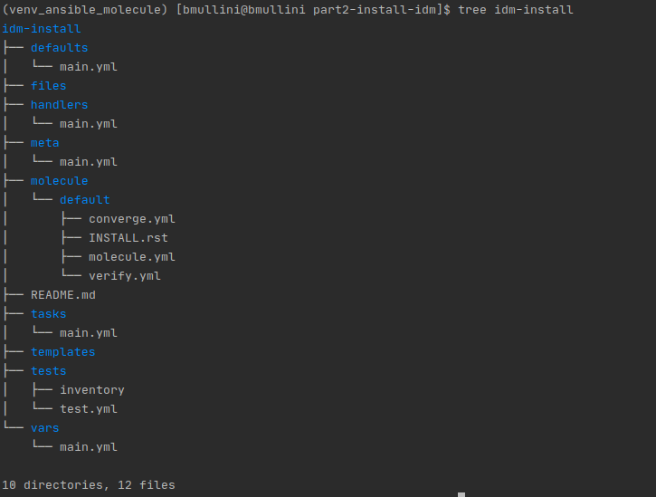

# Installation of IDM on AWS

Last updated: 06.23.2020

## Purpose

The purpose of this document is to teach the reader how to use
Ansible and Ansible Molecule to come up with a working installation
of RedHat IDM (FreeIPA) on AWS.

## Procedure
1. Activate your virtual environment created in
[part1](../part1-setup-environment).

1. Open up a terminal window.

1. Copy the **ansible.cfg** down from the git repo under the
folder **part2-install-idm**.

1. Set the path to the **ansible.cfg** by setting the environment variable:

    `ANSIBLE_CONFIG=$(pwd)/ansible.cfg`

1.  Run `ANSIBLE_CONFIG`
  
1. Create the Ansible Molecule role called **idm-install**

    1. Run `molecule init role --driver-name docker idm-install`
    1. Run `tree idm-install`
    
        You should get the following output:
        
        

    1. cd idm-install/molecule/default
    1. rm molecule.yml
    1. Create **molecule.yml** and add the following contents:
    
        ```yaml
        dependency:
          name: galaxy
        driver:
          name: docker
        platforms:
          - name: instance
            image: centos:8
            pre_build_image: true
            command: /sbin/init
            tmpfs:
              - /run
              - /tmp
            volumes:
              - /sys/fs/cgroup:/sys/fs/cgroup:ro
        provisioner:
          name: ansible
        verifier:
          name: ansible
        scenario:
          name: default
          test_sequence:
            - create
            - prepare
            - converge
            - verify
            - destroy

        ```
     
     1. Create the **prepare.yml** and add the following
     contents:
     
         ```yaml
         ---
         - name: Prepare
           hosts: all
           gather_facts: false
           tasks:
             - name: Install python for Ansible
               yum:
                 name: "{{ item }}"
                 use_backend: "dnf"
               with_items:
                 - python3
                 - python3-pip
             - name: Install Ansible
               command: "pip3 install ansible==2.9"
         ```
         The **prepare.yml** will install python3 and 
         ansible before running the **tasks/main.yml**.   

      1. rm verify.yml
      1. Create the **verify.yml** file and add the following contents:
      
          ```yaml
           ---
           # This is an example playbook to execute Ansible tests.
           
           - name: Verify
             hosts: all
             tasks:
               - name: Run setup
                 setup:
                 register: output_setup
               - name: Print setup
                 debug:
                   var: output_setup
           
               - name: Install this only for local dev machine
                 debug:
                   msg: "Your hostname is correctly set to '{{ ansible_fqdn }}'."
                 when: ansible_fqdn == "idm.example.com"
           
               - name: You did not set the host name
                 fail:
                   msg:  "Your host name is '{{ ansible_fqdn }}' and should be 'idm.example.com'"
                 when: ansible_fqdn != "idm.example.com"

          ``` 
         
      1. cd ../..
      1. Run `molecule converge`
      1. Run `molecule verify`

            The test should fail.  We haven't written any
            code or configuration to name the docker instance.
            The purpose of the test in TDD is to
            first prove that a test fails without writing any
            code.
      1. Run `molecule destroy`
      1. Add the following line under the **platforms**
        **--name** attribute in the **molecule.yml** and
        save the file.
        
            hostname: idm.example.com
      1. Run `molecule converge`
      1. Run `molecule verify`.  
        
            Verification should
            be successful.  We added configuration to the
            **molecule.yml** to spin up the docker
            container with the fully qualified domain
            name of **idm.example.com**. We are now
            back in the **Green** state for the
            **Red, Green, Refactor** iteration of Test
            Driven Development (TDD).
        
        
        
  
:construction: Under Construction.....