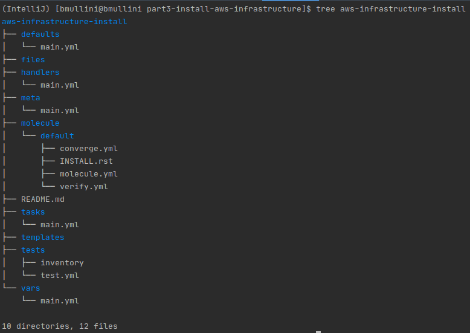

# Installation of OpenShift Cluster on AWS

Last updated: 08.11.2020

## Purpose

The purpose of this document is to teach the reader how to use Ansible
and Ansible Molecule to create an ansible role that installs and configures
the AWS infrastructure for the OpenShift cluster.

## Prerequisites

### Create your Python Virtual Environment

Follow the instructions in [part1](../part1-setup-environment) to
create your virtual environment.

### Setup your AWS Environment

1. Open up a terminal
1. mkdir -p $HOME/.aws
1. cd $HOME/.aws
1. Make the file **.env**
1. Edit your **.env** file.  Enter the following
environment variables:

      ```yaml
       AWS_REGION="us-east-1 <this value should be different if you don't live close to the US east coast.>"
       AWS_ACCESS_KEY_ID="<your aws access key id: should be in your credentials.csv file>"
       AWS_SECRET_ACCESS_KEY="<your aws secret access key:  should be in your credentials.csv file>"
      ```
   
1. cd
1. Edit your **.bashrc** file.  Add the following line:  

    `source $HOME/.aws/.env`

1. Save your **.bashrc** file and close your terminal window.

Now your AWS account credentials can be accessed by your
Python virtual environment and Ansible Molecule.

## Procedure

1. Open up a terminal window.

1. Make sure you **source** your virtual environment

1. mkdir **part3-install-aws-infrastructure**

1. Copy the **Dockerfile** down from the git repo under the
folder  **part3-install-aws-infrastructure**  

1. cd **part3-install-aws-infrastructure**  
1. Run `docker build -t part3-install-aws-infrastructure .`

   The command above will create a docker image
   on your machine called **part3-install-aws-infrastructure**.
   The image ensures that python3, pip3, boto, boto3 and ansible 2.9
   are installed.  We installed **ansible** on the image
   because the image will be used by **molecule**, and
   molecule requires ansible to run tests.  The Amazon ansible modules
   require the  **boto** and **boto3** packages.

1. Create the Ansible Molecule role called **aws-infrastructure-install**

    1. Run `molecule init role --driver-name docker aws-infrastructure-install`
    1. Run `tree aws-infrastructure-install`
    
        You should get the following output:
        
        

1. cd idm-install/molecule/default

1. rm molecule.yml

1. Create **molecule.yml** and add the following contents:

    ```yaml
        ---
        dependency:
          name: galaxy
        driver:
          name: docker
        platforms:
          - name: instance-aws-infrastructure
            image: part3-install-aws-infrastructure
            pre_build_image: true
        provisioner:
          name: ansible
          log: true
        verifier:
          name: ansible
          options:
            v: 4
        scenario:
          name: default
          test_sequence:
            - create
            - prepare
            - converge
            - verify
            - destroy


    ```
1. Add the following variables to the **default/main.yml**.

    ```yaml
        ---
        # defaults file for aws-infrastructure-install
        aws_infrastructure_install_vpc:
          name: "openshift_dev_vpc"
          label: "Openshift Development Cluster VPC"
          gateway: "openshift_dev_vpc_gateway"
          route_table: "openshift_dev_vpc_route_table"
          security_group: "openshift_dev_vpc_security_group"
          subnets:
            control:
              name: "aws_infrastructure_control_subnet"
              cidr: "192.168.1.0/24"
              mtu: 1500
            data:
              name: "aws_infrastructure_data_subnet"
              cidr: "192.168.2.0/24"
              mtu: 9200
          cidr: "192.168.0.0/16"
        
        aws_region: "{{ lookup('env', 'AWS_REGION') }}"
        aws_access_key: "{{ lookup('env', 'AWS_ACCESS_KEY_ID') }}"
        aws_secret_key: "{{ lookup('env', 'AWS_SECRET_ACCESS_KEY') }}"
    ```

1. <a name="1stTDD"></a> Add the **vpc** with the [1st TDD Iteration](./1st-tdd-iteration).
1. <a name="2ndTDD"></a> Add the **vpc subnets** with the [2nd TDD Iteration](./2nd-tdd-iteration).
1. <a name="3rdTDD"></a> Add the **vpc gateway** with the [3rd TDD Iteration](./3rd-tdd-iteration).
1. <a name="4thTDD"></a> Add the **vpc route table** with the [4th TDD Iteration](./4th-tdd-iteration).
1. <a name="5thTDD"></a> Add the **vpc security group** with the [5th TDD Iteration](./5th-tdd-iteration).

You have just completed the creation of the Ansible role. Continue with the tutorials
[here](../readme.md).