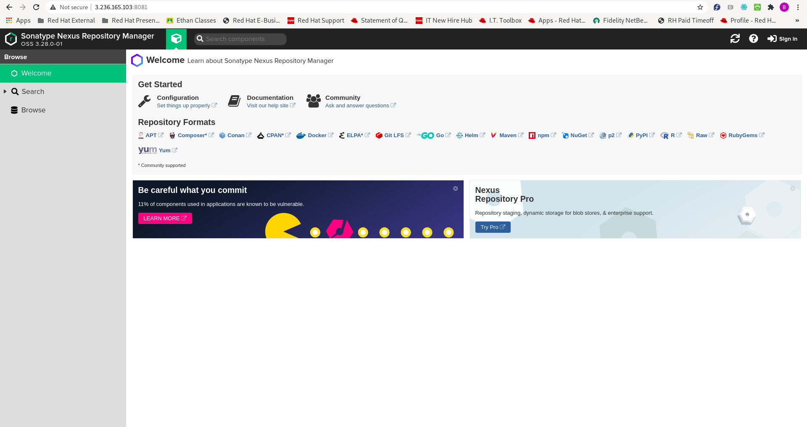

# Installation of Nexus on AWS

Last updated: 10.05.2020

## Purpose

The purpose of this document is to teach the reader how to use Ansible
and Ansible Molecule to create an ansible role that installs and configures
Nexus.

## Prerequisites

AWS Account and permissions to create/delete AWS EC2 instances

### Setup your Python Virtual Environment

You will need a Python virtual environment to work in.  Please
set up your environment by following the instructions
[here](../part1-setup-environment/readme.md).

### Setup your AWS Environment

1. Open up a terminal
1. mkdir -p $HOME/.aws
1. cd $HOME/.aws
1. Make the file **.env**
1. Edit your **.env** file.  Enter the following
environment variables:

      ```yaml
       AWS_REGION="us-east-1 <this value should be different if you don't live close to the US east coast.>"
       AWS_ACCESS_KEY_ID="<your aws access key id: should be in your credentials.csv file>"
       AWS_SECRET_ACCESS_KEY="<your aws secret access key:  should be in your credentials.csv file>"
      ```
   
1. cd
1. Edit your **.bashrc** file.  Add the following line:  

    `source $HOME/.aws/.env`

1. Save your **.bashrc** file and close your terminal window.

Now your AWS account credentials can be accessed by your
Python virtual environment and Ansible Molecule.


## Procedure

1. Open up a terminal window.
1. mkdir **part6-install-nexus**
1. cd **part6-install-nexus**
1. Copy the "requirements" file down for your virtual environment
1. Open up a terminal
1. Activate your virtual environment (after you open any new terminal).  
   This is very important and could lead  to a corruption of your system
   if you don't.
1. Install the required AWS software needed to interact with AWS:
   
    ```pip install -r requirements```

1. Create the **nexus-instance** ansible role using the following command:

    ```shell script
     molecule init role -d delegated nexus-instance
    ```
1. cd nexus-instance
1. mkdir files
1. mkdir private_keys
1. cd files/private_keys
1. Create a file with the same name as your AWS private key having no
   extension.
1. Add your AWS private key contents to the file.
1. chmod 600 [your aws private key file]
    
    **Note**: Please make sure you don't check this file into git.  If you make the
    repository public, you would expose your private key.  I always add a
    **.gitignore** file that contains **private_keys/**.  This tells git to ignore
    the folder.
    
1. cd ../..
1. cd default
1. Add the following variables to the **default/main.yml** file
 
    ```yaml
    ---
    yum_installs:
      - name: "java-1.8.0-openjdk-devel"
        install_name: "java-1.8.0-openjdk"
      - name: "tar"
        install_name: "tar"
    yum_backend: dnf
    
    domain_name: example.com
    fqdn: nexus-server.{{ domain_name }}
    
    use_ssl: true
    nexus_ssl_dir: /opt/nexus/sonatype-work/nexus3/etc/ssl
    nexus_properties_dir: /opt/nexus/sonatype-work/nexus3/etc
    nexus_jetty_config_dir: /opt/nexus/nexus-3.28.0-01/etc/jetty
    ssl_cert_organization: 'ACME CORP'
    ```

    The explanation of the **default/main.yml** file can be found 
    [here](../part5-register-idm-client/readme.md#default_main_explanation).

1. cd vars
1. Edit the file **main.yml** and add the following variables:

    ```yaml
    open_nexus_ports:
      - "8081/tcp"
      - "8082/tcp"
      - "8083/tcp"
      - "8443/tcp"
    ```
    
    The variable deserves some explanation:
    
    1. **open_nexus_ports** = The ports to open up for the nexus
       server.

1. cd ..
1. Make the file "vault_secret".  This file will be used to 
   store your vault password.
1. Open up "vault_secret" and enter your password for ansible vault.
1. Run the following command to encrypt your **SSL cert password**.

      ``` 
      ansible-vault encrypt_string "[your_ssl_cert_password here]" --vault-password-file ./vault_secret
      ```
1. Copy the output from **!vault** to the last line before **Encryption successful**.
1. cd defaults
1. Open up the main.yml file.
1. Add the variable "ssl_cert_password", and paste the copied encrypted password
   as the value.
1. Save the file.
1. cd molecule/default
1. Edit the **converge.yml** and add `become: true` before the **tasks:** keyword.

1. Remove the **molecule.yml** file.
1. Create a new **molecule.yml** file and add the following content:

    ```yaml
    ---
    dependency:
      name: galaxy
    driver:
      name: delegated
      ssh_connection_options:
        - '-o ControlPath=~/.ansible/cp/%r@%h-%p'
    platforms:
      - name: nexus-server
    provisioner:
      name: ansible
      config_options:
        defaults:
          remote_user: centos
          vault_password_file: ${MOLECULE_PROJECT_DIRECTORY}/vault_secret
        privileged_escalation:
          become: true
          become_ask_pass: false
    verifier:
      name: ansible
    scenario:
      test_sequence:
        - dependency
        - lint
        - cleanup
        - destroy
        - syntax
        - create
        - prepare
        - converge
        - side_effect
        - verify
        - cleanup
        - destroy
    ```

    The explanation of the **molecule.yml** file can be found 
    [here](../part5-register-idm-client/readme.md#molecule_explanation).

1. mkdir vars

1. cd vars

1. Create the file **main.yml** and add the following content:

    ```yaml
    aws_vpc_name: "aws_openshift_vpc"
    aws_subnet_name: "aws_subnet"
    aws_security_group: "aws_openshift_vpc_security_group"
    aws_region: "{{ lookup('env', 'AWS_REGION') }}"
    aws_access_key: "{{ lookup('env', 'AWS_ACCESS_KEY_ID') }}"
    aws_secret_key: "{{ lookup('env', 'AWS_SECRET_ACCESS_KEY') }}"
    ec2_instances:
      - name: "nexus-server"
        user: "centos"
        key_pair: "my_keypair"
        aws_ami: "ami-00594b9c138e6303d"
        root_volume_size: 30
        port: 22
    ```
    
    The explanation of the variables can be found 
    [here](../part5-register-idm-client/readme.md#vars_main_explanation).

1. Delete the **create.yml** file.

1. Add the following content to the **create.yml** file.

    ```yaml
    ---
    - name: Create
      hosts: localhost
      connection: local
      gather_facts: true
      tasks:
    
        - name: Include the variables needed for creation
          include_vars:
            file: "vars/main.yml"
    
        - name: Set molecule directory
          set_fact:
            molecule_ephemeral_directory:
              '{{ lookup(''env'', ''MOLECULE_EPHEMERAL_DIRECTORY'') }}'
    
        - name: AWS Private Key file location
          set_fact:
            aws_private_key_file: "../../files/private_keys/{{ ec2_instances[0].key_pair }}"
    
        - name: Set the molecule directory private key
          set_fact:
            aws_molecule_private_key_file:
              "{{ molecule_ephemeral_directory }}/private_key"
    
        - name: Copy the private key to the molecule config directory
          copy:
            src: "{{ aws_private_key_file }}"
            dest: "{{ aws_molecule_private_key_file }}"
            mode: 0600
    
        - name: Get VPC Facts
          ec2_vpc_net_info:
            aws_access_key: "{{ aws_access_key }}"
            aws_secret_key: "{{ aws_secret_key }}"
            region: "{{ aws_region }}"
            filters:
              "tag:Name": "{{ aws_vpc_name }}"
          register: vpc_info
    
        - name: Fail if the VPC does not exist
          fail:
            msg:  "The VPC called '{{ aws_vpc_name }}' does not exist."
          when:
            - vpc_info.vpcs is not defined or vpc_info.vpcs | length  == 0
    
        - name: Gather facts on the AWS Control subnet
          ec2_vpc_subnet_info:
            aws_access_key: "{{ aws_access_key }}"
            aws_secret_key: "{{ aws_secret_key }}"
            region: "{{ aws_region }}"
            filters:
              "tag:Name": "{{ aws_subnet_name }}"
          register: vpc_control_subnet_info
    
        - name: Fail if we do not get a subnet for the EC2 instance
          fail:
            msg: "We could not obtain the {{ aws_subnet_name }} subnet"
          when:
            - vpc_control_subnet_info is undefined or
              vpc_control_subnet_info.subnets is undefined or
              vpc_control_subnet_info.subnets | length == 0
    
        # Single instance with ssd gp2 root volume
        - name: Create EC2 Instance
          ec2:
            key_name: "{{ ec2_instances[0].key_pair }}"
            group: "{{ aws_security_group }}"
            instance_type: t2.medium
            image: "{{ ec2_instances[0].aws_ami }}"
            wait: true
            wait_timeout: 500
            volumes:
              - device_name: /dev/sda1
                volume_type: gp2
                volume_size: "{{ ec2_instances[0].root_volume_size }}"
                delete_on_termination: true
            vpc_subnet_id: "{{ vpc_control_subnet_info.subnets[0].id }}"
            assign_public_ip: true
            count_tag:
              Name: "{{ ec2_instances[0].name }}"
            instance_tags:
              Name: "{{ ec2_instances[0].name }}"
            exact_count: 1
          register: ec2_facts
    
    
        - name: Set public ip address for ec2 instance
          set_fact:
            aws_public_ip: "{{ ec2_facts.tagged_instances[0].public_ip }}"
    
        - name: Populate instance config dict
          set_fact:
            instance_conf_dict: {
              'instance': "{{ item.name }}",
              'address': "{{ aws_public_ip }}",
              'user': "{{ item.user }}",
              'port': "{{ item.port }}",
              'identity_file': "{{ aws_molecule_private_key_file }}",
              'become_method': "sudo",
              'become_ask_pass': false,
    
            }
          with_items: "{{ ec2_instances }}"
          register: instance_config_dict
    
        - name: Convert instance config dict to a list
          set_fact:
            instance_conf:
              "{{ instance_config_dict.results
              | map(attribute='ansible_facts.instance_conf_dict') | list }}"
    
        - name: Dump instance config
          copy:
            content: "{{ instance_conf
              | to_json | from_json | molecule_to_yaml | molecule_header }}"
            dest: "{{ molecule_instance_config }}"
    
    
        - name: Wait for SSH
          wait_for:
            port: 22
            host: "{{ aws_public_ip }}"
            search_regex: SSH
            delay: 10
            timeout: 320
    
        - name: Wait for boot process to finish
          pause:
            minutes: 2
    ```
    
    The description of the **create.yml** file can be found 
    [here](../part5-register-idm-client/readme.md#create_molecule).

1. Delete the **destroy.yml** file.

1. Create the **destroy.yml** file and add the following contents:

    ```yaml
    ---
    - name: Destroy
      hosts: localhost
      connection: local
      gather_facts: false
      no_log: "{{ molecule_no_log }}"
      tasks:
    
        - name: Include the variables needed for creation
          include_vars:
            file: "vars/main.yml"
    
        - name: Populate instance config
          set_fact:
            instance_conf: {}
    
        - name: Dump instance config
          copy:
            content: "{{ instance_conf | to_json | from_json | molecule_to_yaml | molecule_header }}"
            dest: "{{ molecule_instance_config }}"
          when: server.changed | default(false) | bool
    
        - name: Gather EC2 Instance Facts
          ec2_instance_facts:
          register: ec2_info
    
        - name: terminate
          ec2:
            instance_ids: "{{ item.instance_id }}"
            state: absent
            wait: yes
          with_items: "{{ ec2_info.instances }}"
          when: item.state.name != 'terminated' and item.tags.Name == ec2_instances[0].name
    ```

    The description of the **destroy.yml** file can be found 
    [here](../part5-register-idm-client/readme.md#destroy_explanation).

1. <a name="1stTDD"></a> Install the required yum packages in the [1st TDD Iteration](./1st-tdd-iteration).
1. <a name="2ndTDD"></a> Install **firewalld** to protect and open only necessary ports [2nd TDD Iteration](./2nd-tdd-iteration).
1. <a name="3rdTDD"></a> Make sure the Nexus server ports are open in the [3rd TDD Iteration](./3rd-tdd-iteration).
1. Add the following variables to the **vars/main.yml** file: 

    ```yaml
    nexus_software_sha1_checksum: "fd7cc1031492aa711517f2e97a4df3fd94f91844"
    nexus_file_name: "nexus-3.28.0-01"
    nexus_file:  "{{ nexus_file_name }}-unix.tar.gz"
    ```
    
    Let's explain these variables.
    
    1. **nexus_software_sha1_checksum** --> The sha1 hash for the downloaded nexus software file.
    
    1. **nexus_file_name** --> The prefix of the downloaded nexus software file.  The prefix ends in
       the nexus version.
       
    1. **nexus_file** --> The full name of the downloaded nexus software file.
    
1. Copy down the the **nexus_instance/files/nexus_software** folder and contents from this git repo
   to the **files** directory.

    **NOTE:**  The nexus files in the **nexus_software** folder were created by doing the following:
    
    1. <a name="change-nexus-software"></a> Go to the Sonatype Nexus site [here](
             https://www.sonatype.com/nexus/repository-oss/download).  You must sign up before you can download.
       
    1. Download the Unix version of the file.  In my case the file is called **nexus-3.28.0-01-unix.tar.gz**
    
        1. Above, the **nexus_file_name** variable value is **nexus-3.28.0-01**.  This is the prefix of the file
           I downloaded.  This is used on the target machine after the file is unarchived.  Currently, 
           the **nexus_file_name** is the folder that contains the **bin** directory for starting the server.  
           **NOTE:**  This can change in the future so if you plan on changing the Nexus software, please unarchive 
           the file to ensure this is the convention.  Otherwise, this Ansible role will fail.
    
    1. Open up a terminal
    
    1. Navigate to the directory you downloaded your file.
    
    1. Run 'sha1 [your downloaded file]'.  Copy this hash and replace the **nexus_software_sha1_checksum**
       value with this hash.  The hash compares the original hash to the resulting tar file after re-combining the
       parts, and when the file is copied by Ansible to the target server, the hash is used to ensure no corruption 
       with the file. 
    
    1. mkdir nexus_software
    
    1. Run "split --bytes=10M [your downloaded file] nexus_software/[your downloaded file].part".
       This splits the file in 10M chunks.  This was done so the software could be added to **git**.  Otherwise,
       the file would be too large to upload to git by default.
    
    1. Replace the **nexus_software** folder in the **nexus_instance/files/** directory with this one.
    
    1. Make sure your the following variables in **vars/main.yml** are populated according to your new tar file
       and sha1 hash:
    
         ```yaml
            nexus_software_sha1_checksum: "fd7cc1031492aa711517f2e97a4df3fd94f91844"
            nexus_file_name: "nexus-3.28.0-01"
            nexus_file:  "{{ nexus_file_name }}-unix.tar.gz"
         ```    

1. <a name="4thTDD"></a> Install the Nexus server software in the [4th TDD Iteration](./4th-tdd-iteration).

After the 4th TDD, we can login to our Sonatype Nexus Server by using our public IP address for the
target server in AWS and using the port **8081**.  Here is a screen shot of what you should expect.  Your IP
address will be different.


    

We have finished the nexus tutorial.  Please continue with the tutorials [here](../readme.md).