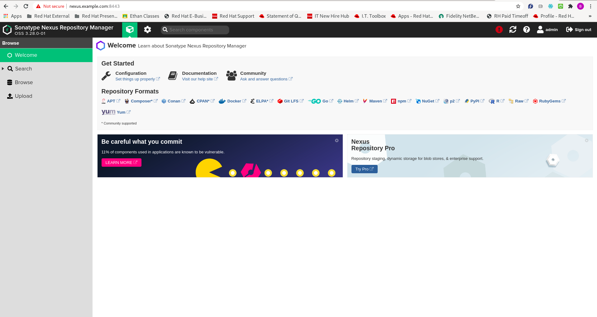
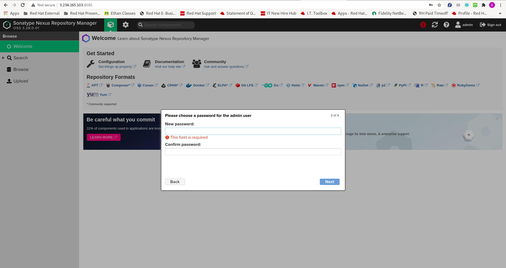
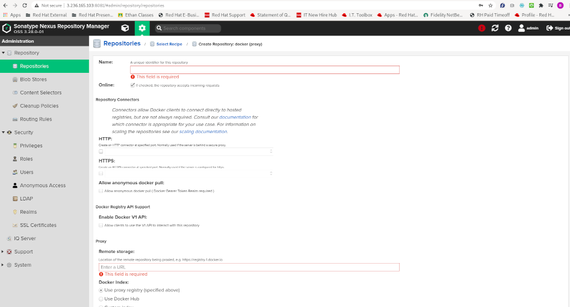

# Configure Docker Registry for Sonatype Nexus Repository

Last updated: 10.05.2020

## Purpose

The purpose of this document is to teach the reader how to configure a
docker registry using the Sonatype Nexus Repository.

## Prerequisites

You must have a running Sonatype Nexus Repository.  If you don't have a Nexus Repository,
you can use the following tutorial [here](../part6-install-nexus) or the
resulting Ansible role to create a Nexus Repository server.

You must have docker installed on another computer to use as a client.

## Procedure

1. Open up your Sonatype Nexus Server Console in the browser as is seen below.

    
    
1. Login to the console by clicking on the **Sign In** button on the top right of the screen.

1. You should get a login dialog similar to the following if you are logging in for the first time.

    
    
    The login screen says to look in the **admin.password** file for the admin password. The example
    below shows me using ssh to login to the Nexus server and navigate to the admin.password file.
    
    
    
    The last command is not ran for security reasons but if ran will show the password.
    
1. Login as the **admin** user.

1. Once logged in, if you are logging in for the first time, you should get a dialog like below.

    
    
1. Click the **Next** button.

1. The following dialog asks for you to change your **admin** password.

    
    
1. Change your password.

1. A dialog appears asking you if you want to allow anonymous access.  Select the option to disable anonymous
   access and click the Next button.
   
    
 
1. Click the **Finish** button.

1. Click on the **Spoke** icon to bring up the Nexus Server and Administration page as is shown below.

    
    
1. Select the **Blob Stores** menu item on the left of the screen.  A **Blob Store** is a location where
   you plan to store data.
   
    
   
1. Select the **Create blob store** button.

    
    
1. Name your first blob store **private_docker_images**.  The file path should be filled in for you.  If you
   have another path, change it here.

    
    
1. Click the **Create blob store** button.

1. Create another blob store called **docker_hub**.  Below you will see the nexus blob stores after creation.

    
    
1. In the left menu select the **Repositories** menu option.  A page similar to the following should appear.

    

1. Select the **Create Repository** button.  The following page appears.

    
    
1. Select the **docker (hosted)** repository type.  The following page appears.

    
    
1. In the **Name** field, enter **private-docker-registry**

1. Under the **HTTP** section, check the checkbox and enter the port **8083**.  Make sure this
   port is open through your firewalls.

1. Under the **Enable Docker V1 API** section, select the **Allow clients to use the V1 API to
   interact with this repository** check box.

1. Under the **Blob Store** section, select the **private_docker_images** blob store.

1. Click the **Create Repository** button.  The summary of repositories page appears.

1. Select the **Create Repository** button.

1. Select the **docker (proxy)** repository type.  The following page appears.

    
  
1. In the **Name** field, enter **docker-hub-registry-1**

1. Under **Remote Storage**, enter the URL `https://registry-1.docker.io/`

1. Select the option **Use Docker Hub**

1. Select **docker_hub** for the blob store.

1. Select the **Create Repository** button.  You should see the **docker-hub-registry-1** and 
the **private_docker_images** repositories like the page below.

    
    
1. Click the **Blob Stores** menu item on the left menu.

1. Select the button **Create blob store**.

1. Enter **docker_group_store** for the name.

1. Select the **Create blob store** button.

1. Select the **Repositories** menu item on the left menu.

1. Click the **Create Repository** button.

1. Select the **docker-group-repo** repository type.  You should see a page similar to below.

    
    

1. In the **Name** field, enter the value **docker-group-repo**

1. Under the HTTP section, check the box and enter port **8082**.

1. Under **Blob store** section, select the **docker_group_store**

1. Under **Member Repositories**, select **docker-hub-registry-1** and move it to the **Members** list.

1. Under **Member Repositories**, select **private-docker-registry** and move it to the **Members** list.

    You should see a form filled out like below:
    
    
    
1. Click on the **Create Repository** button.

### Configure Your Docker

#### For Debian Linux

**NOTE:**  Replace the IP addresses in the instructions with your Nexus Server IP or Domain Name

1.  sudo systemctl stop docker
1.  sudo cp /etc/docker/daemon.json /etc/docker/daemon_backup
1.  In your **/etc/docker/daemon.json** file, enter the following contents replacing the IP address
    with your IP address or DNS name of your Sonatype Nexus repository.

 
    ```json
    {
      "insecure-registries": [
        "http://3.236.165.103:8082",
        "http://3.236.165.103:8083"
      ],
      "disable-legacy-registry": true
    }
    ``` 

#### For Fedora or RHEL

**NOTE:**  Replace the IP addresses in the instructions with your Nexus Server IP or Domain Name

1. sudo systemctl stop docker
1. sudo cp /etc/sysconfig/docker /etc/sysconfig/docker_backup
1. In your **/etc/sysconfig/docker** file, enter the following lines at the
   end of your **OPTIONS** string:
   
   ```shell script
    --insecure-registry http://3.236.165.103:8082 --insecure-registry http://3.236.165.103:8082 \
   ```

### Login to your registries

**NOTE:**  Replace the IP addresses in the instructions with your Nexus Server IP or Domain Name

1. sudo systemctl start docker
1. docker login -u admin -p "your password" 3.236.165.103:8082
1. docker login -u admin -p "your password" 3.236.165.103:8083

    

### Perform Docker Commands Against the Registries

1. docker pull 3.236.165.103:8082/httpd:2.4-alpine

    
    
1. Login to your Sonatype Nexus Server

1. Click the **Cube** icon on the menu above.  The icon represents the **Browsing** page.

1. On the left of the **Browsing page**, select the **Browse** menu item.

1. Select the **docker-group-repo** list item.

1. Expand the **library** node.  You should see your **httpd:2.4-alpine** image cached as is shown the image
   below.
   
   


Please continue to follow along as this tutorial gets created over the next couple of days.


:construction: Under Construction.....